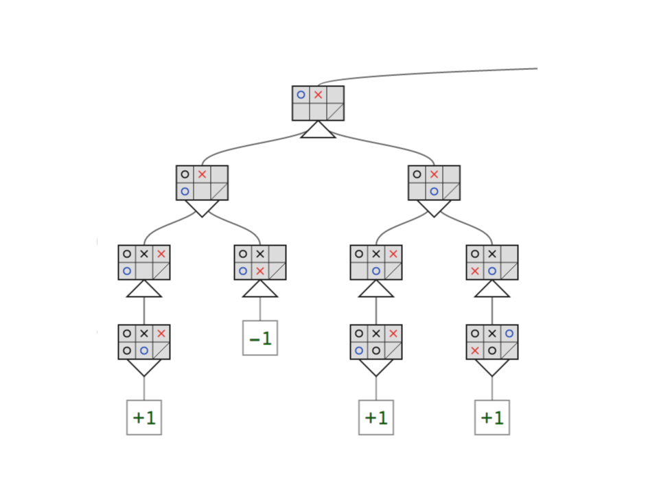

# Mini-Project: Coding Minimax

Now that the lectures have introduced the core concept of minimax and you've walked through the basic procedure in the quizzes the next step is to do it all with code. In this exercise you're going to implement the minimax algorithm to solve the same game presented in the lecture quizzes. This mini-project won't be submitted for review, but it'll give you a head start on the first part of the project for this module.

We're going to work through minimax search in three parts:

* Review the algorithm in pseudocode
* Develop a class to represent the game state and rules of the game
* Implement the minimax algorithm

## Part 1: Minimax Search Pseudocode

The Artificial Intelligence a Modern Approach textbook provides psuedocode for the minimax algorithm that defines a pair of [mutually recursive](https://en.wikipedia.org/wiki/Mutual_recursion) helper functions that traverse the min and max levels of the game tree to find the value of each branch, and a decision function called from the root node that chooses the optimal move from the root of the game tree based on the value of each branch. The two helper functions are nearly identical except for the utility returned in terminal states, and the use of the max or min comparison function.

*Note*: It is also common to see minimax presented as a simply [recursive function](https://en.wikipedia.org/wiki/Minimax#Pseudocode) by treating the helper functions as conditional branches, or even (under certain assumptions) to eliminate separate cases for handling min and max levels altogether as in [negamax](https://en.wikipedia.org/wiki/Negamax#Negamax_base_algorithm). However, we will adhere to the version from the AIMA text in this exercise, because it separates the functionality for handling the min level and max level nodes (which makes it easier to test), and more clearly illustrates that you only need to choose a move from the root node -- all other children nodes only need to return a value.

## Part 2: Game State Representation

To code the minimax algorithm, first you'll implement a class to keep track of the game state for the mini-isolation game from Thad's quiz. The game state object will handle all of the rules of the game, and include all of the information describing the specific configuration of the game at a particular point in time. At a minimum, the board state needs to keep track of which cells are open and closed; which player has initiative (whose turn it is to move); and where each player is on the board. (Note: Remember to block off the lower right corner when you create a new board!) Your class only needs to define two methods: `forecast_move()` and `get_legal_moves()`.

We will attach a coordinate frame to the board in the top left corner and set the x axis to move from left to right and the y axis to move from top to bottom. Each cell on the board can be described by an ordered pair `(x, y)`. Thus (0, 0) is the top-left corner; (2, 1) is the bottom right corner (the blocked cell).

The `forecast_move()` method will take a move (a pair of coordinates `(x, y)` of the desired endpoint of the player) and return a *new* game state object (you should not mutate game state objects). Treating the game state as immutable makes it trivial to roll out and unwind each branch of the game tree (children nodes will simply be garbage collected when the caller returns). (Hint: check out the `copy.deepcopy` module from the standard library to copy your board state.)

The `get_legal_moves()` method takes no arguments and returns a `list` (the tests will fail for any other type of collection) of moves available to the active player in the current state. The "active" player is the agent with initiative to move (e.g., on an empty board player 1 is the active player). According to the game rules, each player can move to any open square for their first move, and then to any open square along a row, column, or diagonal from their current position. (Note that players cannot jump or pass through blocked squares.)

_First code implementation_

Returning copies of the game state when forecasting moves has significant overhead (especially in Python), and returning a complete list of all legal moves is inefficient (a generator would be better), but both conventions simplify the underlying implementation & interface for the minimax algorithm. We will use a similar interface in the module project.

When performance matters, it is typical to use [bitboards](https://en.wikipedia.org/wiki/Bitboard).

## Part 3: Implementing the Minimax Algorithm

You will implement the minimax algorithm in two parts, by first implementing helper functions (a terminal state test, `min-value`, and `max-value`), then implementing the decision function. Notice that the min-value and max-value functions only need to return a single value representing a score; the function for selecting a move will come later.

 We will also make two simplifying assumptions in order to adhere to the conventions of Thad's quizzes:

* Assumption 1: a state is terminal if the active player has no remaining moves
* Assumption 2: the board utility is -1 if it terminates at a max level, and +1 if it terminates at a min level

The first assumption is only required in order to allow the second assumption. In general, we can determine that a game is terminal if either player has no remaining moves, but that would require terminal nodes at both min and max levels to support returning +1 or -1 depending on which player is the winner. Restricting the terminal condition to the active player means that there is only one possible return value at min or max nodes.

The second assumption is specified in the lecture quizzes. Technically, any pair of values can be used to indicate wins and losses so long as they admit an ordering such that the score for winning is greater than the score for losing; e.g., instead of -1 & +1 you could you use -π & π/2, or 100.99 & 101.0, or -∞ & +∞. It is common to use -∞ & +∞ when a heuristic function is used (which we'll do in another project for this module) because it ensures that the heuristic value never exceeds the range of wins or losses.

**Important Note**: Notice that the value does not depend on which player is "active" on the board. A win for the searching player (the player that initiated the search from the root of the game tree) is always worth +1 and a loss is always worth -1. One very common mistake is to "flip" the utility between min and max nodes, but the score should be relative to the desirability of the outcome for the searching player.

Now complete the helper functions in the quiz below.

_Second code implementation_

Now it's time to bring it all together to complete the minimax algorithm. The `minimax()` function should loop over the legal moves from the current state and return the move that has the highest score according to the `min_value()` helper function. (We call `min_value()` first instead of `max_value()` because the root node itself is a "max" node.) One way to implement this function has a body that looks very similar to the `max_value()` function, except that you must keep track of both the best score and best move (and return only the best move), but there are other ways as well (hint: check out the built-in [max](https://docs.python.org/2/library/functions.html#max) function and the optional keyword argument `key`).

_Third code implementation_

## Conclusion

That's it--you've completed the minimax algorithm! Your code should now correctly choose one of the winning branches of the game tree from an empty mini-isolation board, just like you did by hand in Thad's quiz. Moreover, if you implement the rules to another game (like tic-tac-toe) in the GameState class, your minimax code will work without any changes on that game, too!

Future lessons will cover additional optimizations like depth-limiting, alpha-beta pruning, and iterative deepening that will allow minimax to work on even larger games (e.g., checkers, chess, etc.), and the project for this module will involve modifying and extending your code from this project to implement some of those techniques.
